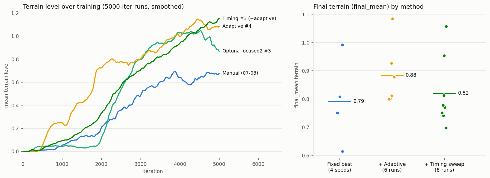

# 📊 Reward Autotuning — 결과 정리 (2026-07-06 ~ 07-17)

> 지표: **final_mean** = terrain-level 곡선 마지막 20% 평균 (최종 도달 수준, 스파이크에 강건).
> 초기엔 auc(면적)를 썼으나 "일찍 오른 run"을 과대평가해 final_mean으로 교체.
> terrain level ≈ 계단 높이 커리큘럼 행: level 1 ≈ 6cm, level 9 ≈ 15cm.



*왼쪽: 대표 run들의 terrain 학습곡선(5000it). Adaptive(노랑)는 초반 가속이 뚜렷하고, Timing #3(초록)가
최고 도달. 오른쪽: 방법별 final_mean 분포(점=개별 run, 가로선=평균). Timing 그룹 평균이 낮아 보이는
것은 sweep 특성상 탐침(나쁜 트리거 조합) run이 섞여 있기 때문 — 비교는 최고값·상위권으로 볼 것.*

## 1. 라운드별 요약

| # | 라운드 (기간) | 탐색 대상 | n | best (final_mean) | 핵심 결과 |
|---|---|---|---|---|---|
| 0 | Manual baseline (07-03) | 수동 튜닝 | 1 | 0.65* | 출발점. terrain end 0.672 |
| 1 | Broad TPE (07-07) | weight 7종 | 3† | — | isaacsim 사고로 17 trial 소실. 승자 → focused 방향 확정 |
| 2 | Focused A/B (07-07~08) | 좁힌 5~3종 | 12+20 | ~0.9 (seed42) | growth·jlvz·entropy만 중요, climb_w·bh 무관 확정. **동일 설정 12배 분산 발견** |
| 3 | Focused2 (07-10~11) | growth/jlvz/entropy | 10 | 0.99 (seed42) | + LandingStability 리워드: bad_orient -41%, 실패 0/10 |
| 4 | **Multiseed** (07-14) | 학습 seed만 | 4 | 0.79 ± 0.14 | **seed42(0.99)는 outlier**. 진짜 non-adaptive 실력=0.79 |
| 5 | **Adaptive** (07-13~14) | penalty_budget, g_min | 6 | **0.88 ± 0.10** | adaptive가 auc 유의(t≈3.3)·final_mean 우세+안정. 최고 #4(pb 0.572, g_min 0.595)=1.08 |
| 6 | **Timing** (07-15~, 진행 중) | hop 트리거 기하 | 8/12 | **1.057** (#3) 🏆 | 역대 최고. 핵심=step_threshold↑(0.049) "확실한 계단만 점프" |
| 7 | PBT + adaptive (대기) | 5개 knob 진화 | 4×5gen | — | 체인 스크립트로 자동 시작 예정 |

\* manual은 5000it 시점 final_mean 재계산값. † 3개만 진짜 완주.

## 2. 확정된 최적 설정 (현재 챔피언 = Timing #3)

```json
{
  "env.rewards.stair_climb.weight": 23.5,
  "env.rewards.stair_climb.params.growth": 2.5251,
  "env.rewards.jump_lin_vel_z.weight": 4.3904,
  "env.rewards.base_height_jump.weight": -15.0,
  "env.curriculum.terrain_levels.params.promote_steps": 3.0,
  "agent.algorithm.entropy_coef": 0.008431,
  "agent.algorithm.learning_rate": 0.001,
  "env.curriculum.adaptive_reward.params.penalty_budget": 0.572,
  "env.curriculum.adaptive_reward.params.g_min": 0.595,
  "env.commands.stair_event.y_halfwidth": 0.1652,
  "env.commands.stair_event.step_threshold": 0.0490,
  "env.commands.stair_event.event_during_time": 0.4913
}
```
+ `--adaptive_reward` 켜기. run: `2026-07-15_19-28-30_sweep003` (final_mean 1.057, ⚠️ 아직 seed 42 단일 — multi-seed 확정 전).

## 3. 파라미터 중요도 (32-trial 종합 + 이후 라운드)

| 파라미터 | 판정 | 근거 |
|---|---|---|
| `stair_climb.growth` | **중요** (2.4~2.6) | A study 중요도 0.60, 상한 붙음 → focused2에서 2.53 수렴 |
| `jump_lin_vel_z.weight` | **중요** (4.4~5.3) | B study 중요도 0.96, hop 임펄스=병목 |
| `entropy_coef` | **중요** (0.007~0.009) | >0.010 대부분 실패 |
| `stair_event.step_threshold` | **중요** (0.049) | timing 상위 2개 모두 ~0.049 — 오발 hop 억제의 실제 레버 |
| `stair_climb.weight` | 무관 (23.5 고정) | 18~26 어디든 동일 (중요도 0.003) |
| `base_height_jump.weight` | 약함 (-15 > -20) | 페널티 약할수록 hop 자유 |
| `promote_steps` | 3 고정 | ⚠️ 지형상 4 초과 불가(타일당 계단 3~4개) |

## 4. 핵심 발견 (논문 재료)

1. **Farming 붕괴**: adaptive 단독(g_min 0.1)이 페널티를 과완화 → reward↑ terrain 0. 자세 페널티 = farming 방지 발판. → g_min ≥ 0.4로 해결.
2. **착지 보상**: LandingStability 추가로 bad_orientation 종료 -41%, sweep 실패율 25%→0%.
3. **학습 분산 지배**: 동일 설정·동일 seed도 GPU 비결정성으로 final_mean 0.61~0.99 요동. **단일 run 비교 금지**, 탐색은 1-seed로 좁히고 승자만 multi-seed 확정.
4. **Adaptive 효과 확정** (밴드 비교): 속도(auc) 유의미 향상 + 최종 높이 평균·안정성 우세. 바닥(최악 seed)이 non-adaptive 평균 수준으로 올라옴.
5. **점프 타이밍**: y_halfwidth(스트립 폭)보다 **step_threshold(확실한 계단만)**가 결정적.
6. **auc vs final_mean**: 목적("최종 높이")에 맞는 metric 선택이 랭킹을 뒤집음.

## 5. 재현 커맨드

```bash
# 챔피언 설정 재학습 (conda activate env_isaaclab 필수)
python scripts/co_rl/train.py --task Isaac-Velocity-Rough-Flamingo-Light-Stair-Jump-v1-ppo \
    --algo ppo --headless --num_envs 8192 --adaptive_reward \
    --param_overrides <위 2절 JSON을 파일로> \
    --warmstart_ckpt logs/co_rl/Flamingo_Light_Flat_Stand_Drive/ppo/2026-07-02_12-12-49/model_1499.pt

# 진행 중 체인 (timing 잔여 → PBT 자동): 상태 확인
tail -f chain.out sweep_timing.out pbt.out
# PBT 결과: logs/co_rl/Flamingo_Light_Rough_Stair_Jump/ppo/_pbt/pbt_<stamp>/history.csv
```
