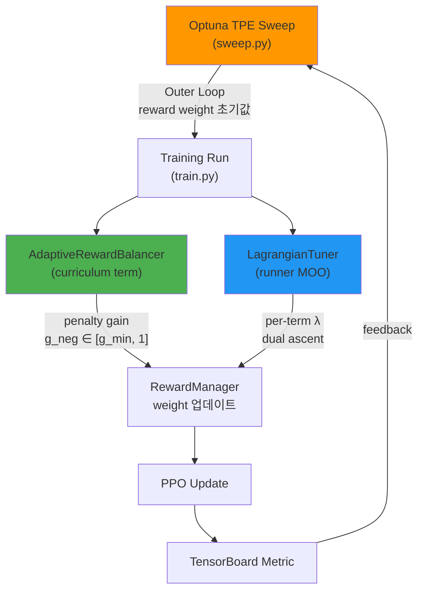

# 🔬 Deep Dive: 경쟁 분석 & 구체적 구현 가이드

이 문서는 [research_advice.md](file:///home/lch/.gemini/antigravity-ide/brain/b641553d-81d2-41ac-85b3-3c5875ee0c10/research_advice.md)의 심화 버전입니다.

---

## 1. Ascento 논문과의 정밀 비교 (핵심 경쟁자)

> [!CAUTION]
> **Chamorro et al. (ICRA 2024)** — "RL for Blind Stair Climbing with Wheeled-Legged Robots"
> (arXiv:2402.06143) 이 논문이 **가장 직접적인 경쟁자**입니다. 반드시 차별화해야 합니다.

| 항목 | Ascento (Chamorro et al.) | Flamingo (우리) |
|------|--------------------------|-----------------|
| **로봇 형태** | Two-wheeled, 2-DOF legs | Two-wheeled, multi-DOF legs |
| **계단 높이** | 15cm (sim + real) | 15cm 목표 (진행 중) |
| **RL Formulation** | **Position-based** (joint target positions) | **Velocity-based** (CO-RL PPO) |
| **Actor-Critic** | **Asymmetric** (critic에 privileged info) | Symmetric (policy/critic 동일 obs) |
| **Exteroceptive** | Blind (height scanner 없음, boolean만) | **Height scanner 사용** (stair_event) |
| **Reward Tuning** | **수동 (hand-tuned)** | **Optuna/PBT 자동 탐색** ⭐ |
| **Hop Trigger** | Boolean mode switch (수동) | **Perception-based 자동 감지** ⭐ |
| **Curriculum** | 없음 (명시적) | **Terrain step-height curriculum** ⭐ |
| **Sim-to-Real** | Zero-shot transfer 성공 | 목표 (진행 예정) |

### 우리가 Ascento보다 앞서는 지점 (Contribution 포인트)

1. **자동 Reward Weight 탐색**: Ascento는 수동 튜닝, 우리는 Optuna/PBT → "scalable, reproducible"
2. **Perception-Triggered Hop**: Ascento는 boolean을 수동으로 켜야 하지만, 우리의 `StairDetectEventCommand`는 height scanner에서 자동 감지 → "deployable without operator intervention"
3. **Terrain Curriculum**: Step height를 점진적으로 높이며 학습 → "sample-efficient progressive training"
4. **Adaptive Penalty Balancing**: ROGER-style online adaptation이 이미 구현됨

### Ascento보다 보완해야 할 부분

1. **Asymmetric Actor-Critic**: Ascento의 핵심 기법. 우리도 critic에 privileged info(정확한 terrain geometry, friction 등)를 넣으면 sim-to-real gap이 줄어들 수 있음
2. **Position-based vs Velocity-based**: Ascento는 position-based가 계단에서 더 효과적이라고 주장. 우리의 velocity-based 접근이 왜 유효한지 실험적으로 보여야 함

---

## 2. ROGER vs 현재 AdaptiveRewardBalancer 비교

ROGER 논문: **"Gain Tuning Is Not What You Need"** (arXiv:2510.10759)

| 항목 | ROGER 원본 | 현재 AdaptiveRewardBalancer |
|------|-----------|--------------------------|
| **대상** | 60kg quadruped (real-world learning) | Flamingo (sim) |
| **조절 대상** | Positive/Negative gain ratio | `g_neg` (penalty gain만) |
| **메커니즘** | Constraint threshold 접근 시 ratio 감소 | EMA reward trend 기반, `penalty_budget` 비율 유지 |
| **파라미터** | Constraint thresholds | `penalty_budget`, `g_min`, `ema`, `adapt_rate` |
| **위치** | [curriculums.py L85-L216](file:///home/lch/Isaac-RL-Two-wheel-Legged-Bot/lab/flamingo/tasks/manager_based/locomotion/velocity/mdp/curriculums.py#L85-L216) | 동일 |

### 현재 구현의 개선 가능 포인트

코드를 보면 `AdaptiveRewardBalancer`는 penalty 전체에 하나의 `g_neg`만 적용합니다.
**개선안**: 각 penalty term별 독립적인 gain → 더 세밀한 제어

```python
# 현재: 모든 penalty에 동일한 g_neg
g = self._g_neg if self._is_penalty.get(name, False) else 1.0

# 개선안: per-term adaptive gain
g = self._g_per_term.get(name, 1.0) if self._is_penalty.get(name, False) else 1.0
```

---

## 3. 이미 갖추고 있는 자동 튜닝 인프라 총정리

> [!NOTE]
> 프로젝트에 이미 **3개의 독립적인 reward 자동 조절 메커니즘**이 구현되어 있습니다.
> 이것들의 관계를 정리하고 체계적으로 통합하는 것 자체가 논문 contribution입니다.

### 인프라 맵



| 메커니즘 | 위치 | 작동 시점 | 목적 |
|---------|------|----------|------|
| **Optuna TPE** | [sweep.py](file:///home/lch/Isaac-RL-Two-wheel-Legged-Bot/scripts/co_rl/sweep.py) | Trial 간 (각 trial은 독립 학습) | Base reward weight 최적 조합 찾기 |
| **AdaptiveRewardBalancer** | [curriculums.py L85](file:///home/lch/Isaac-RL-Two-wheel-Legged-Bot/lab/flamingo/tasks/manager_based/locomotion/velocity/mdp/curriculums.py#L85) | 학습 중 (reset마다 EMA 업데이트) | Penalty gain 동적 조절 |
| **LagrangianTuner** | [lagrangian_tuner.py](file:///home/lch/Isaac-RL-Two-wheel-Legged-Bot/scripts/co_rl/core/modules/lagrangian_tuner.py) | 학습 중 (iteration마다) | Per-term weight의 dual ascent |
| **CaT** | [constraint_rl_env](file:///home/lch/Isaac-RL-Two-wheel-Legged-Bot/lab/flamingo/isaaclab/isaaclab/envs/manager_based_constraint_rl_env.py) | Episode 중 (constraint 위반 시 terminate) | Constraint-based training |

### 핵심 통찰

- **Optuna** (between-run) + **AdaptiveRewardBalancer** (within-run)는 **bi-level optimization**
- **LagrangianTuner**는 AdaptiveRewardBalancer와 **별도 경로**로 weight를 수정 (충돌 가능!)
  - 현재는 `moo` config가 비어있으면 LagrangianTuner가 비활성
  - 둘 다 켜면 서로 weight를 덮어씀 → 통합 필요
- **CaT**를 쓰면 penalty reward를 constraint로 전환 → 탐색 차원 줄임

---

## 4. PBT 구현 구체 계획

현재 [sweep.py](file:///home/lch/Isaac-RL-Two-wheel-Legged-Bot/scripts/co_rl/sweep.py)는 이미 PBT의 기반을 갖추고 있습니다 (주석에도 명시됨). 핵심 차이는 **독립 실행 → 체크포인트 공유**입니다.

### PBT vs 현재 Optuna의 차이 (코드 레벨)

```diff
# 현재 Optuna (sweep.py L317-L369)
- 각 trial이 처음부터 끝까지 독립 학습 (max_iterations 전체)
- trial 간 정보 공유 없음 (TPE가 파라미터만 가이드)

# PBT 모드 (추가 구현)
+ population을 동시에 학습 (각 K steps만)
+ K steps마다 성적 비교 → 하위 agent가 상위 agent의 checkpoint 복사
+ reward weight를 perturb (explore)
+ 총 학습량은 같지만 좋은 weight를 빨리 발견
```

### 구현 핵심: `sweep.py`에 PBT 모드 추가

기존 `run_trial()` 함수는 full training을 돌리지만, PBT에서는 **partial training** (K steps) + **checkpoint load/save**가 필요합니다.

```python
# PBT 핵심 로직 (sweep.py에 추가할 함수)

def run_pbt(cfg, results_dir, python, goal):
    """Population-Based Training: exploit/explore with checkpoint sharing."""
    pop_size = cfg.get("pop_size", 8)
    K_steps = cfg.get("pbt_interval", 500)     # 매 500 iter마다 exploit/explore
    total_steps = cfg["max_iterations"]
    exploit_frac = cfg.get("exploit_frac", 0.2)  # 하위 20%
    perturb_scale = cfg.get("perturb_scale", 0.2)
    
    rng = random.Random(cfg.get("seed", 42))
    
    # 1. 초기 population 생성 (각각 다른 reward weight)
    population = sample_random(cfg["parameters"], pop_size, rng)
    ckpt_paths = [None] * pop_size  # 각 agent의 최신 checkpoint
    metrics = [float('-inf')] * pop_size
    
    for gen in range(total_steps // K_steps):
        # 2. 각 agent를 K_steps만 학습
        for i, params in enumerate(population):
            row = run_trial_partial(
                idx=i, params=params, cfg=cfg,
                results_dir=results_dir, python=python,
                max_iter=K_steps,                    # 부분 학습
                resume_ckpt=ckpt_paths[i],           # 이전 checkpoint에서 이어서
            )
            ckpt_paths[i] = row["ckpt_path"]
            metrics[i] = row["metric"]
        
        # 3. Exploit: 하위 20% → 상위 20%의 checkpoint 복사
        ranked = sorted(range(pop_size), key=lambda i: metrics[i], reverse=True)
        n_replace = max(1, int(pop_size * exploit_frac))
        top = ranked[:n_replace]
        bottom = ranked[-n_replace:]
        
        for bad_idx in bottom:
            good_idx = rng.choice(top)
            ckpt_paths[bad_idx] = ckpt_paths[good_idx]  # 좋은 모델 복사
            
            # 4. Explore: reward weight perturb
            for key in population[bad_idx]:
                old_val = population[good_idx][key]
                factor = 1.0 + rng.uniform(-perturb_scale, perturb_scale)
                population[bad_idx][key] = round(old_val * factor, 6)
        
        print(f"[PBT] gen {gen}: best={metrics[ranked[0]]:.3f}, "
              f"worst={metrics[ranked[-1]]:.3f}")
```

### 수정이 필요한 파일들

| 파일 | 변경 내용 |
|------|----------|
| [sweep.py](file:///home/lch/Isaac-RL-Two-wheel-Legged-Bot/scripts/co_rl/sweep.py) | `run_pbt()` 함수 추가, `method: pbt` 분기 |
| [train.py](file:///home/lch/Isaac-RL-Two-wheel-Legged-Bot/scripts/co_rl/train.py) | `--max_iterations`를 K_steps로 짧게 실행 가능하도록 확인 (이미 지원됨) |
| [on_policy_runner.py](file:///home/lch/Isaac-RL-Two-wheel-Legged-Bot/scripts/co_rl/core/runners/on_policy_runner.py) | `--resume`로 checkpoint 이어서 학습 (이미 지원됨 L441-L453) |
| sweep YAML | `method: pbt`, `pbt_interval`, `pop_size`, `perturb_scale` 추가 |

> [!TIP]
> **핵심 장점**: 기존 인프라를 거의 재활용할 수 있습니다. `train.py`는 이미 
> `--max_iterations`와 `--resume`를 지원하므로, PBT의 partial training + checkpoint resume가 
> subprocess 호출로 바로 동작합니다.

---

## 5. Reptile 메타러닝 통합 계획

Reptile은 기존 코드 위에 **가장 적은 수정으로** 메타러닝을 올릴 수 있는 방법입니다.

### 개념

```
Task Distribution T = {(stair_height=3cm), (stair_height=5cm), ..., (stair_height=15cm)}
                    × {(reward_set_1), (reward_set_2), ...}

meta_weights θ₀ = initial_policy_weights

for outer_step in range(N_meta):
    θ_task = θ₀.clone()
    task = sample(T)                           # 랜덤 계단 높이 + reward set
    θ_task = train(task, θ_task, K_inner)       # K inner gradient steps
    θ₀ += ε * (θ_task - θ₀)                    # Reptile 업데이트
```

### 구현 방법 (train.py 확장)

```python
# scripts/co_rl/reptile.py (새 파일)

def reptile_meta_train(task_configs, n_outer, n_inner, epsilon, base_ckpt):
    """
    task_configs: list of (task_name, param_overrides) 튜플
    n_inner: 각 task에서 학습할 iteration 수
    epsilon: meta learning rate
    """
    # 1. meta_weights 로드
    meta_state = torch.load(base_ckpt)
    meta_weights = meta_state["model_state_dict"]
    
    for outer in range(n_outer):
        # 2. 랜덤 task 샘플
        task_name, overrides = random.choice(task_configs)
        
        # 3. meta_weights에서 시작하여 n_inner steps 학습
        #    (subprocess로 train.py 호출, 또는 직접 runner.learn() 호출)
        temp_ckpt = f"reptile_temp_{outer}.pt"
        torch.save(meta_state, temp_ckpt)
        
        run_partial_training(
            task=task_name,
            resume_ckpt=temp_ckpt,
            max_iter=n_inner,
            param_overrides=overrides,
        )
        
        # 4. 학습 후 weights 로드
        task_state = torch.load(f"model_{n_inner}.pt")
        task_weights = task_state["model_state_dict"]
        
        # 5. Reptile 업데이트: θ₀ += ε * (θ_task - θ₀)
        for key in meta_weights:
            if key in task_weights and meta_weights[key].shape == task_weights[key].shape:
                meta_weights[key] += epsilon * (task_weights[key] - meta_weights[key])
        
        meta_state["model_state_dict"] = meta_weights
    
    torch.save(meta_state, "reptile_meta_policy.pt")
```

### Task Distribution 정의

```yaml
# reptile_config.yaml
tasks:
  - task: Isaac-Velocity-Rough-Flamingo-Light-Stair-Jump-v1-ppo
    overrides:
      # 3cm stairs (terrain level 0 고정)
      env.scene.terrain.max_init_terrain_level: 0
      env.rewards.stair_climb.weight: 15.0

  - task: Isaac-Velocity-Rough-Flamingo-Light-Stair-Jump-v1-ppo
    overrides:
      # 8cm stairs 
      env.scene.terrain.max_init_terrain_level: 3
      env.rewards.stair_climb.weight: 25.0

  - task: Isaac-Velocity-Rough-Flamingo-Light-Stair-Jump-v1-ppo
    overrides:
      # 15cm stairs
      env.scene.terrain.max_init_terrain_level: 6
      env.rewards.stair_climb.weight: 40.0

meta:
  n_outer: 100
  n_inner: 300      # 각 task에서 300 iter
  epsilon: 0.3       # meta learning rate
```

---

## 6. RAL 실험 매트릭스 (구체적 실험 계획)

### 실험 1: Reward Weight Optimization 방법 비교 (핵심 Table)

| ID | Method | 설명 | GPU Hours (예상) |
|----|--------|------|-----------------|
| B1 | Manual | 수동 튜닝 (현재 config의 default weight) | ~5h × 3 seeds |
| B2 | Grid Search | sweep.py `method: grid` | ~120h |
| B3 | Optuna (TPE) | sweep.py `method: optuna`, 20 trials | ~100h |
| B4 | PBT | sweep.py `method: pbt`, pop=8 | ~40h |
| B5 | PBT + Adaptive | PBT + `--adaptive_reward` 동시 사용 | ~40h |
| B6 | Reptile + PBT | Meta-trained init → PBT fine-tune | ~60h |

**측정 지표:**
- `max_stair_height`: 학습 완료 후 도달 가능한 최대 계단 높이
- `success_rate@15cm`: 15cm 계단 100회 시도 중 성공 횟수
- `time_to_threshold`: terrain_level 5 도달까지의 학습 시간
- `action_smoothness`: `Σ|a_t - a_{t-1}|²` (sim-to-real transferability 지표)
- `energy_consumption`: `Σ|τ·ω|` (효율성)

### 실험 2: Ablation Study

| ID | 구성 | 목적 |
|----|------|------|
| A1 | PBT without Adaptive Balancer | Adaptive Balancer의 기여 분리 |
| A2 | Adaptive Balancer without PBT | 고정 weight에서 Adaptive만 |
| A3 | PBT without Curriculum | Curriculum의 기여 분리 |
| A4 | PBT + CaT (penalty→constraint) | Constraint 전환의 효과 |
| A5 | Per-term Adaptive vs Global g_neg | Adaptive 세밀도의 영향 |

### 실험 3: Sim-to-Real Transfer

| ID | 조건 | 측정 |
|----|------|------|
| R1 | Best sim policy → real 3cm stair | 성공률, 시도 횟수 |
| R2 | Best sim policy → real 8cm stair | 성공률 |
| R3 | Best sim policy → real 15cm stair | 성공률 |
| R4 | Smoothness-optimized policy → real 15cm | B5 vs B4 sim-to-real gap 비교 |

---

## 7. 논문 Writing Tips (RAL 특화)

### RAL 포맷 주의사항
- **6페이지 + 참고문헌** (추가 1페이지 멀티미디어 가능)
- **반드시 영상 첨부**: supplementary video에 sim + real 결과
- **Reviewer 3명** (보통 1명은 RL, 1명은 로봇, 1명은 시스템)

### 차별화 포인트 강조 방법

```
❌ 약한 주장: "We use Optuna to tune reward weights."
   → Reviewer: "그건 엔지니어링이지 연구가 아닙니다."

✅ 강한 주장: "We propose a bi-level reward optimization framework 
   where PBT discovers reward weight schedules coupled with terrain 
   curriculum stages, while an online penalty-gain controller (inspired 
   by ROGER) adaptively balances constraint satisfaction within each 
   training epoch. We demonstrate that this combination reduces the 
   manual tuning effort from ~40 GPU-hours to zero while achieving 
   15cm stair climbing — previously shown only with hand-tuned rewards."
   → Reviewer: "명확한 기여, 체계적 검증, 실용적 임팩트"
```

### 핵심 Figure 구성 (6-page 내 배치)

1. **Fig 1**: System overview (로봇 사진 + framework diagram) — **1페이지**
2. **Fig 2**: Bi-level optimization framework 도식 (Optuna/PBT outer + Adaptive inner) — **Method**
3. **Fig 3**: Reward weight evolution over PBT generations (어떻게 수렴하는지 시각화) — **Results**
4. **Fig 4**: Learning curves 비교 (B1-B6, terrain_level vs iteration) — **Results**
5. **Fig 5**: Sim-to-real stair climbing 시퀀스 (연속 프레임) — **Results**
6. **Table I**: 방법 비교 (max height, success rate, GPU hours) — **Results**

---

## 8. 즉시 실행 가능한 다음 단계

### 이번 주 (Week 1)
```bash
# 1. 현재 Optuna sweep 실행 (이미 준비됨)
python scripts/co_rl/sweep.py \
  --config scripts/co_rl/sweeps/stair_jump_focused.yaml \
  --dry_run  # 먼저 trial 목록 확인

# dry_run 확인 후 실행
python scripts/co_rl/sweep.py \
  --config scripts/co_rl/sweeps/stair_jump_focused.yaml
```

### 다음 주 (Week 2)
1. Optuna 결과 분석 → 중요 파라미터 식별
2. sweep.py에 PBT 모드 추가 시작
3. Adaptive Balancer 활성화해서 Optuna+Adaptive 조합 테스트

### 구현 요청 시
위 PBT 구현이나 Reptile 통합을 코드로 작성해드릴 수 있습니다. 
어떤 것부터 시작할지 알려주세요:
- **A**: sweep.py에 PBT 모드 추가
- **B**: Reptile meta-training 스크립트 작성
- **C**: AdaptiveRewardBalancer per-term 개선
- **D**: 실험 자동화 파이프라인 (결과 수집 + 비교 테이블 생성)
