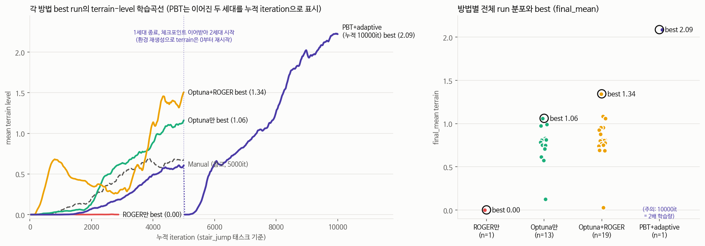
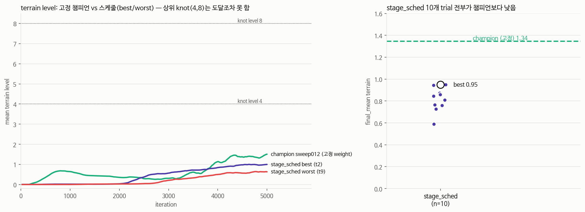

# 📊 방법별 비교 — ROGER만 vs Optuna만 vs Optuna+ROGER vs PBT+adaptive

> 2026-07-19 작성, 2026-07-20 PBT 추가+정정. 모든 수치는 **TB 원본에서 final_mean으로
> 전면 재계산**한 값 (초기 study들의 CSV metric은 auc로 기록돼 있어 그대로 비교하면 안 됨
> — 아래 §2).



*왼쪽 그림 주의: PBT 곡선(보라)은 **gen0(0~5000it)과 gen1(5000~10000it, 체크포인트를
이어받아 재학습) 두 run을 이어붙여 누적 iteration으로 표시**한 것 — 다른 세 방법(단일
5000it run)과 x축 범위가 다르다. gen1은 환경이 새로 생성돼 자체 terrain 곡선이 0부터
다시 시작하지만(점선 경계 이후 급상승 구간), **누적 학습량은 5000it가 아니라 10000it**임에
유의. 이 confound는 §1 요약표·§4-D에서 자세히 다룸.*

## 1. 결과 요약

| 방법 | n (runs) | best (final_mean) | best run | 비고 |
|---|---|---|---|---|
| ROGER만 (adaptive 단독) | 1 | **0.00** (붕괴) | 07-06_21-49-05 | 수동 weight+밸런서. farming 붕괴 |
| Optuna만 (weight 탐색, 밸런서 OFF) | 13 | **1.06** | focused2 #8 | 5000it, seed 42 |
| Optuna + ROGER (탐색된 weight+밸런서 ON) | 19 | **1.34** | timing **sweep012** | 재개된 timing sweep의 TPE 정제 trial |
| **PBT + adaptive** (population 진화) | 8 | **2.09** 🏆⚠️ | gen1 **m0** | **누적 10000it** (다른 방법의 2배) — 공정비교 아님, §4-D 참고 |
| Optuna+ROGER **+ 커리큘럼 스케줄** (approach D) | 10 | 0.95 ❌ | trial 2 | 5000it, **챔피언(1.34)보다 전부 낮음** — §4-E 참고 |

**현재 최고 기록**: PBT gen1의 **m0**가 final_mean **2.087**로 전 방법 최고. 단 이 값은
⚠️ **공정한 비교가 아니다** — m0는 gen0(5000it)+gen1(5000it)을 이어 학습해 **stair_jump
누적 학습량이 10000 iteration**인 반면, 표의 다른 모든 best는 5000it 단일 run이다. 즉
"PBT가 더 낫다"보다는 "①좋은 초기 설정(round-1 승자 파라미터를 round-2 center로 사용)
+ ②2배의 학습량"이 섞인 결과 — 어느 쪽 기여가 큰지는 미분리(§4-D 상세 참고). **단, 세대마다 커리큘럼이 0부터 재시작하는 프로토콜이라 처음부터 학습
시 그대로 재현되는지는 미검증** — 아래 §4-D의 한계 참고.
(재개된 timing sweep의 **sweep012**도 final_mean **1.34**로 Optuna+ROGER 자체 최고 기록.
설정 = config#3 weight + adaptive#4 노브 + 트리거(step_threshold 0.0415). 곡선 최대 mean
terrain 1.51, 종료 시점에도 상승 중. 둘 다 ⚠️ seed 42 단일 — multi-seed 확정 필요.)

**해석**: ROGER 단독은 실패(페널티 과완화→farming), Optuna 단독은 견실, **Optuna+ROGER 결합이
더 낫고, 그 위에 PBT의 세대 진화(exploit/explore)를 얹으면 한 번 더 도약**. Optuna가 좋은
weight/트리거를 찾고, ROGER식 밸런서가 페널티를 온건하게(g_min 0.6~0.71) 풀어 가속하고,
PBT가 좋은 lineage를 이어받아 계속 밀어붙이는 3단 구조가 데이터로 성립.

## 2. Metric — 정의·수식·재계산 사유

**주 지표 `final_mean`** (terrain-level 곡선의 말기 평균):

```
terrain(i) = 전체 env(8192개)의 지형 난이도 행 인덱스 평균 (iteration i 시점)
N = 기록된 iteration 수,  K = ceil(0.2 × N)          # tail_frac = 0.2

final_mean = (1/K) × Σ_{i=N-K+1..N} terrain(i)        # 마지막 20% 구간 평균
```

- 스파이크 1회에 안 속고(평균), **최종 도달 수준**을 반영. goal=max.
- 구 지표 `auc = Σ trapezoid(terrain, iter)` (곡선 아래 면적)는 "일찍 오른 run"을
  과대평가 → 최종 도달이 더 높은 run이 낮게 랭크되는 문제로 폐기.

**재계산이 필요했던 이유**: focused2·adaptive study의 CSV에는 auc가, timing study에는
final_mean이 저장돼 있어 **혼재**. auc는 iteration 수에도 비례해 run 길이가 다르면 비교 불가.
→ 본 문서의 모든 값은 각 run의 TB 이벤트에서 `final_mean(tail 0.2)`로 **일괄 재계산**한 것.

**terrain level → 계단 높이 환산**:

```
step_height(level) = 0.05 + (level / 10) × 0.10   [m]     (row 0=5cm, row 9≈15cm)
```

| 방법 | final_mean | 환산 계단 높이 |
|---|---|---|
| Optuna+ROGER 챔피언 (sweep012) | 1.34 (max 1.51) | ≈ 6.3cm (max 6.5cm) |
| **PBT+adaptive 현 최고 (gen1 m0)** | **2.09** | ≈ **7.1cm** |

이 값은 **8192개 env의 평균**이라, 이미 승급 조건(에피소드당 max_step≥3, §3)을 만족하고
있는 상위 env들은 이 평균보다 **더 높은 행에 있을 것**으로 추정된다 — 단, TB에는
`Curriculum/terrain_levels`의 **평균**만 스칼라로 기록되고 env별 개별 레벨 분포는 로깅되지
않아 "몇 cm까지 갔다"는 실측값은 아니었다(추정치였음).

**→ 히스토그램 로깅 추가함(2026-07-20)**: `OnPolicyRunner._log_terrain_level_histogram`
(`scripts/co_rl/core/runners/on_policy_runner.py`)이 매 iteration `env.unwrapped.scene.
terrain.terrain_levels`(env별 실제 레벨 텐서, 8192개)를 직접 읽어
`Curriculum/terrain_levels_hist`로 히스토그램 기록. 커리큘럼 term이나 IsaacLab 코드는
무수정(CurriculumManager는 여전히 스칼라 평균만 다룸) — 러너가 별도 경로로 raw 텐서에
접근. flat/커리큘럼 없는 태스크에서는 안전하게 스킵. **다음 학습부터** TB에서 이 태그를
보면 "상위 env가 실제로 몇 행까지 갔는지"를 평균이 아니라 분포로 직접 확인 가능.

## 3. terrain level 승급 기준 (커리큘럼 동작)

에피소드가 끝날 때(리셋 시) env마다 판정한다 — [`stair_terrain_levels_climb`](../lab/flamingo/tasks/manager_based/locomotion/velocity/mdp/curriculums.py):

```
max_step = 그 에피소드에서 도달한 '새 최고 높이'를 5cm 공칭 단위로 센 값
           (StairClimbProgress가 base_height_scanner로 추적; 내려갔다 다시 올라온 건 무효)

max_step ≥ 3  (≈ 순수 상승 15cm)  →  승급: 다음 행(계단 더 높은 지형)으로
max_step < 1  (5cm도 못 오름)      →  강등: 이전 행으로
그 사이                            →  유지
```

- TB의 `Curriculum/terrain_levels` = 전체 env 행 인덱스의 **평균**.
- ⚠️ 지형 제약: 타일당 계단이 3~4개뿐이라 promote_steps를 4 초과로 올리면 level 0에서
  물리적으로 달성 불가(커리큘럼 정지).

## 4. 방법별 실험 상세

### 4-A. ROGER만 (온라인 페널티-게인 밸런서 단독)
- **방식**: 수동 튜닝된 기존 reward weight 위에 `AdaptiveRewardBalancer`만 켬.
  매 리셋마다 페널티 3종(flat_orientation, stand_still, base_height_jump)의 글로벌 게인
  g_neg를 "페널티합 ≈ 0.5×태스크보상합"이 되도록 이동, g_min=0.1까지 허용.
- **실험 수**: 1 run (2026-07-06, ~2900it에서 중단)
- **sweep HP**: 없음 (고정 노브: penalty_budget 0.5, g_min 0.1)
- **결과**: g_neg가 0.377까지 내려가 페널티 발판 붕괴 → 평지 제자리 hop farming
  (reward 98→120↑, terrain 0.67→**0.00**). **단독 사용 금지 판정**의 근거.

### 4-B. Optuna만 (TPE weight 탐색, 밸런서 OFF)
- **방식**: `sweep.py`(TPE, SQLite study)로 train.py를 trial마다 서브프로세스 실행,
  `--param_overrides`로 weight 주입. broad→focused→focused2 3라운드로 범위 축소.
- **실험 수**: 본 비교엔 5000it 통일 조건 **13 runs**
  (focused2 10 + multiseed 3; 그 외 3000it 라운드 broad/focused A·B 35+ runs는 범위 축소용).
- **sweep HP**: `stair_climb.weight`(→23.5 고정 판정), `stair_climb.growth`(→2.4~2.6),
  `jump_lin_vel_z.weight`(→4.4~5.3), `base_height_jump.weight`(→-15),
  `entropy_coef`(→0.007~0.009), `learning_rate`(→1e-3), `promote_steps`(→3),
  multiseed 라운드는 `agent.seed`만.
- **결과**: best **1.06** (focused2 #8). 4-seed 밴드 0.61~0.99(평균 0.79) — seed 분산 큼.

### 4-C. Optuna + ROGER (bi-level: 탐색된 weight + 밸런서 ON)
- **방식**: weight는 Optuna 승자(config#3)로 고정, `--adaptive_reward` 켜고
  **밸런서 노브·트리거 기하를 TPE로 탐색** (Outer=Optuna, Inner=ROGER식 온라인 조절).
- **실험 수**: **19 runs** = adaptive sweep 6 + timing sweep 13(12 trial+재시도 1).
- **sweep HP**:
  - adaptive sweep: `penalty_budget` 0.3~0.7(→0.57), `g_min` 0.4~0.8(→0.60 — 과거 붕괴 원인이던 0.1 하한을 올린 게 핵심)
  - timing sweep: `y_halfwidth` 0.08~0.20(→0.165), `step_threshold` 0.025~0.05(→**0.042~0.049**), `event_during_time` 0.4~0.6(→0.47~0.49)
- **결과**: best **1.34** (sweep012). 초반 수렴속도(auc)도 비-adaptive 대비 유의미(t≈3.3).

### 4-D. PBT + adaptive (population 진화, bi-level 위에 세대 진화 추가)
- **방식**: config#3+adaptive#4+timing승자를 center로, population 4가 5000it/세대로 학습하며
  세대말에 하위 25%가 상위 25%의 **체크포인트+파라미터를 복사(exploit)**하고 5개 knob을
  ±20% 변이(explore). 1-GPU 순차 실행(동시 학습 아님 — 멤버 하나씩 차례로).
- **실험 수**: population 4 × 2세대 = **8 member-runs** (세대0 4개 + 세대1 4개).
- **sweep 방식 아님 — evolve 대상 5개**(경계): `growth` 2.4~3.4, `jump_lin_vel_z` 3.5~7.0,
  `entropy_coef` 0.004~0.012, `penalty_budget` 0.35~0.8, `g_min` 0.45~0.85.
  (timing 트리거 3종은 세대0 center에 고정 이식, 진화 대상 아님)
- **세대별 결과** (final_mean, 균일 재계산):

  | 세대 | m0 | m1 | m2 | m3 |
  |---|---|---|---|---|
  | gen 0 | 0.558 | 0.071 | **0.740**(top) | 0.676 |
  | gen 1 | **2.087**🏆 | 0.655 | (재개 진행중) | (대기) |

  **정정(2026-07-20)**: gen0→gen1 exploit은 **m1이 m2를 복사**한 것("member 1 exploits
  [2]" 로그로 확인)이지, **m0는 exploit 대상이 아니라 자기 자신의 체크포인트**
  (`g0m0/model_4999.pt`)를 이어 gen1에서 5000it 더 학습한 것이다(m0의 params는
  round-1 PBT 승자를 이 라운드의 `center_params`로 미리 박아둔 것이라 처음부터
  이미 좋은 설정이었음). 즉 **gen1 m0 = stair_jump 태스크로 5000+5000 = 10000
  iteration 누적 학습**한 네트워크 — 다른 모든 방법(5000it 단일)의 정확히 2배.
  ⚠️ **성능향상(1.34→2.09)이 "좋은 파라미터" 덕분인지 "학습량 2배" 덕분인지 미분리**
  — PBT의 exploit 메커니즘 자체가 기여했다고 단정할 근거는 약하다(m0는 exploit 안 됐음).
  다만 사용자 지정 상한(jump 학습 ≤10000it, sim 오버피팅 방지)과 정확히 일치해
  **규칙 위반은 아니나, 세대를 하나 더(gen2, 15000it) 늘리면 규칙을 넘는다** — 이번
  라운드가 이 lineage의 학습량 한계.
- **실행 중 발견한 버그와 수정**: `pbt.py`가 세대 **끝에만** state.json을 저장해 세대 도중
  크래시하면 이미 끝난 멤버(g1m0의 2.087!)까지 재학습해 잃을 뻔함 + 마지막 세대 뒤에도
  불필요한 exploit/explore가 한 번 더 돌아 최고 멤버를 덮어쓸 위험이 있었음. → 멤버별
  `"done"` 플래그를 추가해 **완료 멤버마다 즉시 저장**, 재개 시 완료분 스킵·미완만 재학습,
  마지막 세대 뒤 exploit/explore는 스킵하도록 수정(2026-07-20). 실제 크래시 지점
  (g1m2, iter~900/5000)을 patched state로 정확히 이어받아 재개 확인.
- **한계**: 세대마다 env가 재생성돼 terrain 커리큘럼이 매번 0부터 재등반 — 지표는
  "이 파라미터 조합이 한 세대 안에 얼마나 빨리/높이 재등반하나"이지 처음부터 학습한
  최종 성능과 프로토콜이 완전히 같지는 않음(단, warm-start 체인이라 실질적으로 누적).
  **2.087은 gen1 시점 seed 42 단일 run** — timing sweep012(1.34)와 마찬가지로
  multi-seed 확정 전이며, 재등반 특성상 처음부터 학습 시 그대로 재현될지는 검증 필요.

### 4-E. Optuna+ROGER + 커리큘럼 스케줄 (approach D) — ❌ 챔피언보다 전부 나쁨



*왼쪽: 고정-weight 챔피언(초록) vs 스케줄 best/worst(보라/빨강)의 terrain 학습곡선. 점선은
스케줄의 knot 레벨(4, 8) — **셋 다 5000it 동안 거기 근처도 못 감**. 오른쪽: 10개 trial
전부가 챔피언(점선) 아래.*

- **방식**: 챔피언(sweep012) weight를 그대로 두되, `CurriculumWeightSchedule`이 선택된
  reward 값(jump_lin_vel_z, stair_climb/growth, landing_stability 등)을 **평균 terrain
  level에 따라 구간선형 보간**하도록 함. knot=level 0(챔피언 값 고정)/4/8. `--adaptive_reward`
  와 `--weight_schedule`를 함께 켬(§4-D의 밸런서가 스케줄이 쓴 base weight 위에서 계속 작동).
- **실험 수**: 10 trials(Optuna TPE, 5000it). 탐색 대상 = level 4/8 knot의 4개 값
  (jump_lin_vel_z 두 단계, stair_climb/growth, landing_stability).
- **결과**: best(trial 2) final_mean **0.95** — 챔피언(1.34)보다 **약 30% 낮음**. **10개
  trial 전원**이 챔피언보다 낮았음(0.59~0.95 범위). "이게 제일 좋을 것"이라는 기대와 반대.

**원인 분석 (실측 로그로 확인, 추측 아님)**:
1. **애초에 탐색 대상(상위 knot)이 한 번도 제대로 쓰이지 못함.** 스케줄 자체 로그
   (`Curriculum/weight_schedule/schedule_level`)를 보면 best trial조차 5000it 끝에
   평균 terrain level이 **겨우 ~1.0**(knot 범위 0~4~8 중 최하단 근처)에 머묾. 즉 **탐색
   변수인 level-4·level-8 knot 값은 이번 실험에서 사실상 한 번도 유효하게 테스트되지
   않았다** — "높은 계단에서 보상을 어떻게 바꿔야 하는가"라는 애초의 가설 자체를 검증할
   기회가 없었음.
2. **그런데도 낮은 구간의 약한 보간만으로 챔피언보다 느려짐.** level~1 지점의 보간
   비율은 (1-0)/(4-0)=25%뿐인데도, 이것만으로 jump_lin_vel_z가 4.39(챔피언 고정값)에서
   학습 끝 무렵 5.46까지 **계속 움직였다**(worst trial도 4.54까지). 챔피언은 이 값이
   **학습 내내 완전히 고정**. 즉 스케줄은 "터레인이 오르자마자 즉시" 보상을 계속 바꾸기
   시작하는데, 이 **끊임없이 움직이는 보상 목표(non-stationary reward)가 PPO의 수렴을
   늦춘 것**으로 보임 — 매우 이른 단계에서조차 안정적으로 고정된 목표를 주는 챔피언 쪽이
   유리했음.
3. **참고**: bad_orientation 종료율은 챔피언·best·worst 셋 다 비슷(0.029~0.037) — 전복 등
   안전 문제가 원인은 아니고, 순수하게 **등반 속도 자체가 스케줄 때문에 느려진 것**.

**결론 및 제안**: 이번 설계(knot을 낮은 레벨부터 바로 보간 시작)로는 접근법D의 가설을
검증하지 못했다. 재시도한다면:
- knot 간격을 좁혀(0/2/4 등) 5000it 예산 안에서 실제로 도달 가능한 범위를 탐색하거나
- 스케줄이 **일정 레벨(예: level≥2) 이후에만 보간을 시작**하도록 해 초반 non-stationarity를
  없애거나
- max_iterations을 늘려(단, 사용자 sim2real 상한 10000it 고려) 상위 knot에 실제로
  도달하게 하거나
중 하나가 필요. **현재로선 approach D가 챔피언(고정 weight)보다 낫다는 근거 없음** —
"이게 제일 좋을 것"이라는 사전 기대는 이번 실험으로 반증됨.

## 5. 한계 (정직하게)

- **모든 best가 학습 seed 42 단일** — seed 분산(±0.15)을 감안하면 1.34 vs 1.06의 차이는
  유력하지만, **챔피언 multi-seed 재검증 전까지 확정 아님**.
- ROGER만은 n=1에 조기중단 run이라 "붕괴한다"는 정성 결론만 유효.
- 방법 간 완전 통제 비교가 아님(예: Optuna+ROGER 19 run엔 timing 기하 탐색이 섞임 —
  "best끼리 비교"는 유효하나 분포끼리의 비교는 탐침 trial이 평균을 끌어내림).
